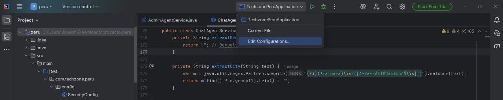
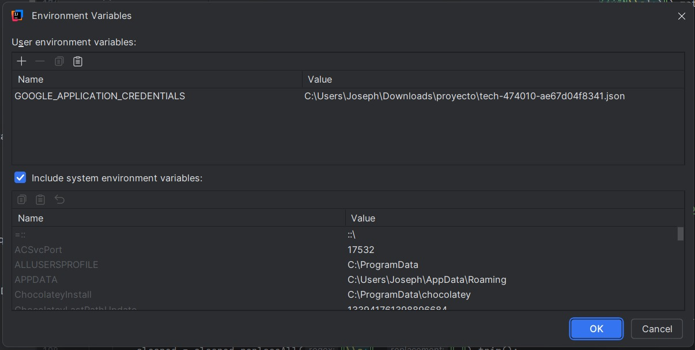

# Configuracion de las Variables de Entorno

### Paso 1: Acceder a la configuracion
Para comenzar, debemos acceder a Run/Debug configurations

### Paso 2: Agregar las Variables de Entorno

luego colocamos la ruta del archivo json Environment variables

### Paso 3: Verificar los Cambios
asi nos debe de quedar

